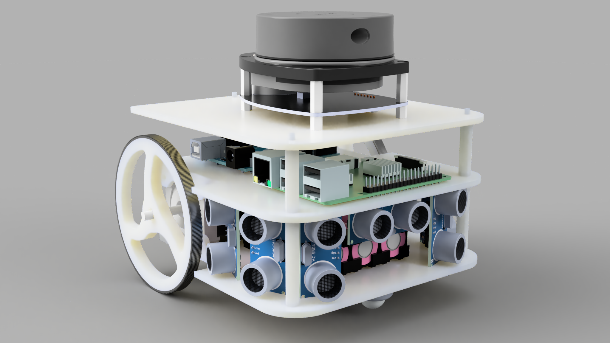
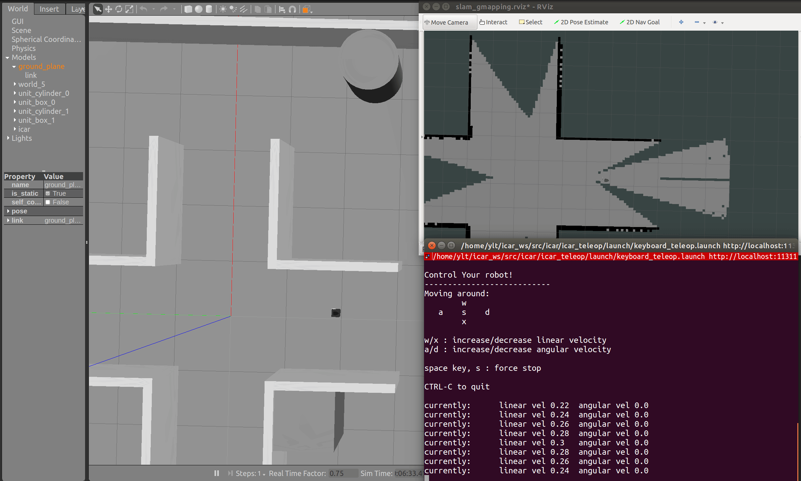
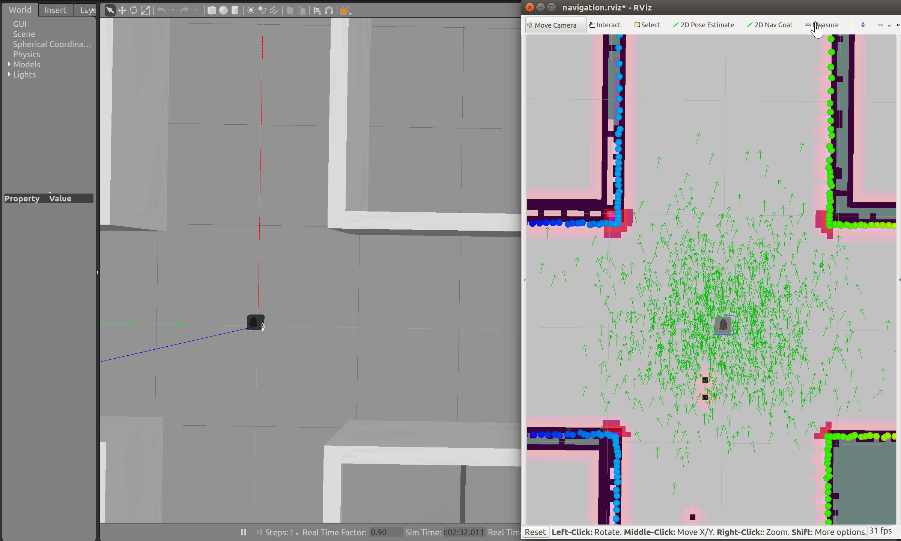

# Icar
​	**Icar**是一款用于ROS学习的低成本高性能双轮差速小车，Icar的设计到做出实物，遵循着性价比的原则，使用最低成本的硬件做出最好的效果，因此，电机选用了两个42步进电机 ，实现高精度的电机运动以及里程计反馈，机身材料全部采用3D打印PLA材质，螺栓均采用塑料尼龙六角柱，底层直接使用**Arduino RosSerial**与树莓派通信，相比串口发送，更简洁、代码量更少。主控使用树莓派3B/3B+/4 ，运行基于 **Raspbian** 的 **Ros Kinetic** ，雷达可搭载思岚的rpdiar a1，或者Robotics的LDS。当前支持手柄 PS3/XBOX360/LeTv ，支持一般的USB摄像头以及微软Kinetic、乐视（奥比中光）astra pro。



> 本仓库为icar的Ros基础功能包。


## 与ICAR相关的仓库

[icar](https://github.com/yltzdhbc/icar.git)：icar机器人ros基础功能包

[icar_multi](https://github.com/yltzdhbc/icar_multi.git)：icar多机编队ros功能包

[icar_base](https://github.com/yltzdhbc/icar_base.git)：icar下位机程序（arduino mega2560）

[icar_manufacture](https://github.com/yltzdhbc/icar_manufacture.git)：icar本体制造相关文件（结构、相关硬件）


## 可能用到的包

[ros-drivers/joystick_drivers: ROS drivers for joysticks (github.com)](https://github.com/ros-drivers/joystick_drivers)

https://github.com/ROBOTIS-GIT/hls_lfcd_lds_driver.git


## 使用

### 在计算机中仿真

#### 启动仿真环境

```
roslaunch icar_gazebo icar_gazebo.launch
```

#### SLAM Demo
```
roslaunch icar_slam gmapping_demo.launch
```



#### Navigation Demo

```
roslaunch icar_navigation nav_demo.launch
```



### 手动控制

```
roslaunch icar_teleop keyboard_teleop.launch
```


## 开机自动运行ROS节点

```shell
// 1、选择no 修改为bash
sudo dpkg-reconfigure dash 

// 2、复制 robot_autostart 到/etc/init.d/文件夹下

// 3、设置权限：
sudo chmod 755 /etc/init.d/robot_autostart

// 4、将脚本加入启动列表
cd /etc/init.d

// 5、95是脚本启动的顺序号，按照自己的需要相应修改即可
sudo update-rc.d robot_autostart defaults 95

// OR、将脚本从启动列表中剔除的方法：
sudo update-rc.d -f robot_autostart remove
```


## Udev固定设备名称

```shell
// 1、cd 到路径
cd robot_ws/src/icar_bringup/scripts

// 2、运行sheel脚本
sh script_comm.sh

// OR如果需要添加
// 自行添加使用 lsusb -v
```


## 修改Linux密码

```shell
sudo passws corvin

sudo passws root
```


## 树莓派挂载网络文件系统ubuntu

### 树莓派端

```shell
// 1、安装nfs环境
sudo apt-get install nfs-common nfs-kernel-server
sudo apt install rpcbind

// 2、修改配置文件
sudo vim /etc/exports
// 加入新行，添加以下内容
/home/corvin *(insecure,rw,sync,async,no_subtree_check)

// 3、重启nfs服务
sudo /etc/init.d/rpcbind restart
sudo /etc/init.d/nfs-kernel-server restart
```

### ubuntu端

```shell
// 1、安装nfs环境
sudo apt-get install nfs-common nfs-kernel-server
sudo apt install rpcbind

// 2、挂载nfs
sudo mount -t nfs IP_OF_RASPI:PATH_OF_RASPI PATH_OF_UBUNTU -o nolock
// IP_OF_RASPI:树莓派的IP  PATH_OF_RASPI:树莓派需要挂载的路径  PATH_OF_UBUNTU:挂载到UBUNTU中的路径
// 例子，在ubuntu 的/mnt下可以看到树莓派的文件
sudo mount -t nfs 192.168.1.100:/home/corvin /mnt -o nolock
```


## ubuntu虚拟机固定IP

```shell
// 1、运行
sudo gedit /etc/network/interface

// 2、粘贴以下内容("ens33"需要根据实际更改，使用ifcofig查看自己的网卡设备名字)
auto ens33
iface ens33 inet static
address 192.168.31.234
netmask 255.255.255.0
gateway 192.168.31.1
iface ens33 inet6 auto 
dns-nameserver  8.8.8.8

// 3、重启
```


## 树莓派固定IP地址

```shell
// 1、运行
sudo nano /etc/dhcpcd.conf

// 2、粘贴以下内容，注意每台机器人改成不同的IP
interface wlan0
static ip_address=192.168.31.200/24
noipv6
static routers=192.168.31.1
static domain_name_servers=192.168.31.1 8.8.8.8

interface eth0
static routers=192.168.0.1
noipv6 
inform 192.168.0.10
```


## 设置工作空间和宏

加在 `.bashrc` 中

```shell
alias cm='catkin_make'
alias sb='source ~/.bashrc'

source /opt/ros/kinetic/setup.bash
source ~/catkin_ws/devel/setup.bash
```


## ROS_REMOT_IP设置

加在 `.bashrc` 中

ROS_CORE 在机器人上

### 机器人树莓派端

```shell
export ROS_MASTER_URI= http://IP_OF_RASPBERRY:11311
export ROS_HOSTNAME= IP_OF_RASPBERRY
```

### 电脑端

```shell
export ROS_MASTER_URI= http://IP_OF_RASPBERRY:11311
export ROS_HOSTNAME= IP_OF_PC
```


## 树莓派3B RaspiberryOs Buster 切换源

```shell
// 1、编辑文件
sudo nano  /etc/apt/sources.list 

// 2、注释掉之前的，复制这两行换上去
deb http://mirrors.tuna.tsinghua.edu.cn/raspbian/raspbian/ buster main contrib non-free rpi
deb-src http://mirrors.tuna.tsinghua.edu.cn/raspbian/raspbian/ buster main contrib non-free rpi

// 3、编辑文件
sudo nano /etc/apt/sources.list.d/raspi.list 

// 4、注释掉之前的，复制这两行换上去
deb http://mirror.tuna.tsinghua.edu.cn/raspberrypi/ buster main ui
deb-src http://mirror.tuna.tsinghua.edu.cn/raspberrypi/ buster main ui

// 5、更新
sudo apt-get update
sudo apt-get upgrade
sudo apt-get dist-upgrade
sudo rpi-update
```

