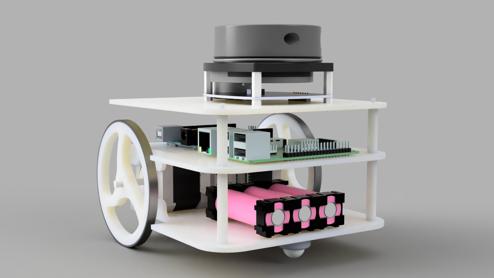

# Icar
​	**Icar**是一款用于ROS学习的低成本高性能双轮差速小车，Icar的设计到做出实物，遵循着性价比的原则，使用最低成本的硬件做出最好的效果，因此，电机选用了两个42步进电机 ，实现高精度的电机运动以及里程计反馈，机身材料全部采用3D打印PLA材质，螺栓均采用塑料尼龙六角柱，底层直接使用**Arduino RosSerial**与树莓派通信，相比串口发送，更简洁、代码量更少。主控使用树莓派3B/3B+/4 ，运行基于 **Raspbian** 的 **Ros Kinetic** ，雷达可搭载思岚的rpdiar a1，或者Robotics的LDS。当前支持手柄 PS3/XBOX360/LeTv ，支持一般的USB摄像头以及微软Kinetic、乐视（奥比中光）astra pro。



> 本仓库为icar的Ros基础功能包。

## 使用

### 在计算机中仿真

#### 启动仿真环境
```
roslaunch icar_gazebo icar_gazebo.launch
```

#### SLAM Demo
```
roslaunch icar_slam gmapping_demo.launch
```


#### Navigation Demo

```
roslaunch icar_navigation nav_demo.launch
```


### 手动控制

```
roslaunch icar_teleop keyboard_teleop.launch
```

